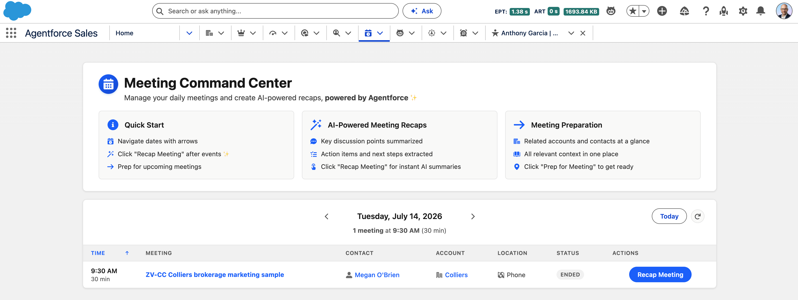

<div align="center">

# Meeting Command Center

Salesforce + Agentforce app for running your day and turning meetings into AI-powered recaps.

[Project](#project) - [What It Includes](#what-it-includes) - [Get Started](#get-started) - [Docs](#docs)



</div>

---

## Project

Meeting Command Center is a Salesforce-native workspace for sellers who live in their
calendar. It brings the day's meetings, the context behind each one, and AI-assisted
follow-up into a single Lightning experience.

The goal is simple: give reps one place to see what's on their schedule, prep with
grounded account context before each meeting, and turn what happened afterward into a
structured recap with suggested next steps - powered by Agentforce and the Einstein
Models API.

## What It Includes

| Area           | What is in the repo                                                                                                                                        |
| -------------- | -------------------------------------------------------------------------------------------------------------------------------------------------------- |
| Salesforce app | Custom objects, fields, flexipages, tabs, permission sets, and the Meeting Command Center Lightning experience.                                            |
| Agentforce     | Einstein Generative AI (Models API) for meeting summaries, key outcomes, and next steps, plus a `Meeting_Intelligence` GenAI plugin for meeting prep.       |
| Apex           | A thin controller facade over composable services for event/recap queries, CRM context, prompt construction, AI content generation, recap persistence, and transcription. |
| LWC            | Command center dashboard, recap modal with voice capture, meeting prep components, and record hover popovers.                                              |
| Integrations   | Deepgram for voice-to-text transcription and Tavily for competitive intelligence, both configured via Custom Metadata.                                     |
| Docs           | Deployment and API setup guides for standing the app up in your own org.                                                                                   |

## Repository Map

- `force-app/main/default` - Salesforce metadata source.
- `force-app/main/default/classes` - Apex services, controllers, and tests.
- `force-app/main/default/lwc` - Lightning Web Components.
- `force-app/main/default/objects` - Custom objects and fields (`Meeting_Recap__c`, `Meeting_Prep__c`).
- `force-app/main/default/genAiPlugins` & `genAiFunctions` - Agentforce meeting intelligence.
- `scripts/apex` - Anonymous Apex helpers for seeding demo meetings.
- `docs` - Screenshots and setup guides.

### Apex architecture

The controller is a thin `@AuraEnabled` facade that delegates to focused, composable services. The LWC contract is unchanged; each concern is independently testable.

| Class                            | Responsibility                                             |
| -------------------------------- | --------------------------------------------------------- |
| `MeetingCommandCenterController` | Public LWC entry points; delegates to the services below.  |
| `MeetingDataService`             | Read-only event, recap, and prep queries.                 |
| `MeetingContextService`          | Account / Contact context + AI activity summaries.        |
| `MeetingContentService`          | AI subject/description generation for events and tasks.   |
| `MeetingRecapService`            | Recap summarization and persistence.                      |
| `MeetingTranscriptionService`    | Deepgram speech-to-text.                                   |
| `MeetingPromptFactory`           | Prompt construction for every AI call.                    |
| `MeetingAIGateway`               | Single Models API integration point.                      |
| `MeetingUtils`                   | Shared JSON helpers.                                       |
| `MeetingPrepIntelligence`        | Agentforce-invocable meeting prep generation.             |
| `MeetingRecapController`         | Read controller for the recap record page.                |

## Get Started

Prerequisites:

- Salesforce CLI.
- A Salesforce org with Einstein Generative AI enabled.
- Free API keys for [Deepgram](https://www.deepgram.com/) (voice transcription) and [Tavily](https://tavily.com/) (competitive intelligence) - both offer free tiers, no credit card required.
- Node.js for local linting and LWC tests.

```sh
sf org login web --alias meeting-command-center
sf project deploy start --source-dir force-app
```

After deploying, finish setup in the org:

1. Assign the `Meeting_Recap_All_Fields` permission set to your users.
2. Add your API keys to the Custom Metadata records:
   - `Deepgram_API_Config__mdt.Default`
   - `Tavily_API_Config__mdt.Default`
3. Add the Meeting Command Center component to a Lightning page or open its tab.

Run Apex tests when validating Salesforce behavior:

```sh
sf apex run test --class-names MeetingCommandCenterControllerTest --result-format human
```

## Usage

1. Navigate to the Meeting Command Center tab or add the component to a Lightning page.
2. Use the date navigation arrows to view meetings for any day.
3. Click **Recap Meeting** on past events to capture notes (typed or by voice) and generate an AI recap with a summary, key outcomes, and next steps.
4. Use **Prep for Meeting** on upcoming events to see related account and contact context at a glance.
5. Review completed recaps directly from the dashboard.

## Docs

- [Deepgram setup guide](DEEPGRAM_SETUP.md)

## Status

This is a proof of concept, not a packaged product. The Salesforce metadata, Apex,
LWCs, and demo assets are kept together so the full story can be reviewed, deployed,
and iterated from one repository.

**No support is provided for this project.** For non-support requests, contact Dylan
Andersen at dylan.andersen@salesforce.com.

**Author:** Dylan Andersen, Senior Solution Engineer, Agentforce at Salesforce
